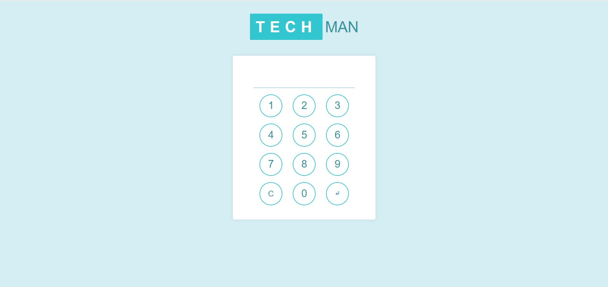
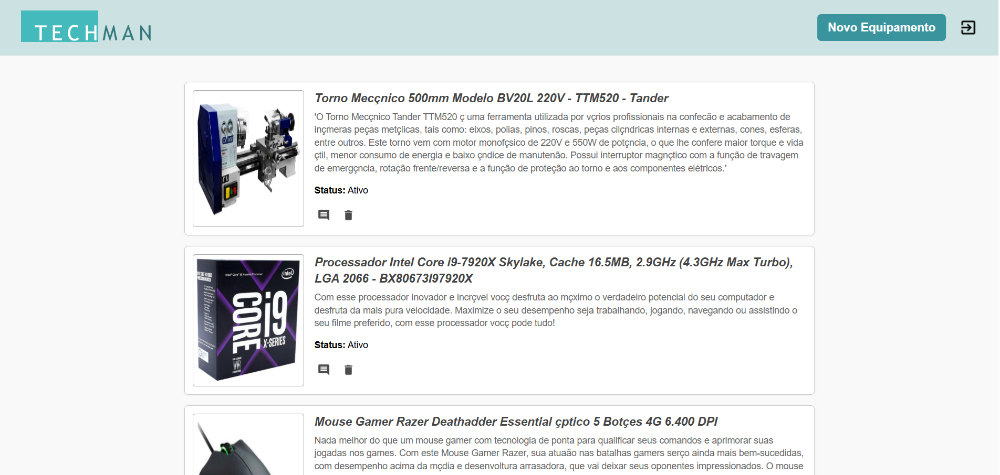
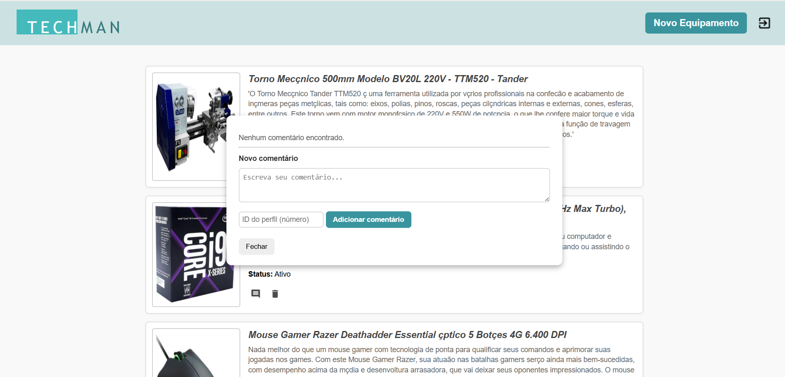

# 🛠️ Techman - Sistema de Gestão de Equipamentos

**Techman** é um sistema web completo para controle de equipamentos industriais e registro de comentários de manutenção preventiva, corretiva, configurações e demais observações técnicas.

---

## 🎯 Objetivo

Facilitar o **gerenciamento do histórico de manutenções** e outros registros de informações sobre equipamentos industriais, permitindo:

- Acesso restrito por senha através de um teclado virtual
- Cadastro, listagem e exclusão de equipamentos (somente administradores)
- Inserção e visualização de comentários por equipamento
- Histórico detalhado dos registros com base no perfil do usuário

---

## 💡 Funcionalidades Principais

- Autenticação com senha numérica (teclado virtual)
- Perfis de usuário com controle de permissões
- Interface intuitiva e responsiva
- Cadastro completo de equipamentos
- Visualização e adição de comentários por equipamento

---

## 🧰 Tecnologias Utilizadas

| Stack         | Tecnologias                                  |
|---------------|-----------------------------------------------|
| Backend (API) | Node.js, Express, Prisma ORM, MySQL           |
| Frontend      | HTML, css, JavaScript |
| Banco de Dados| MySQL, Prisma                                |

---

## 📷 Telas do Projeto

### Tela de Login


### Lista de Equipamentos


### Comentários


### Novo Equipamento


---


## 📦 Como executar o projeto

```bash
git clone https://github.com/Gabihdemori/Techman.git
cd api
npm install
npx prisma migrate dev
npm run dev
