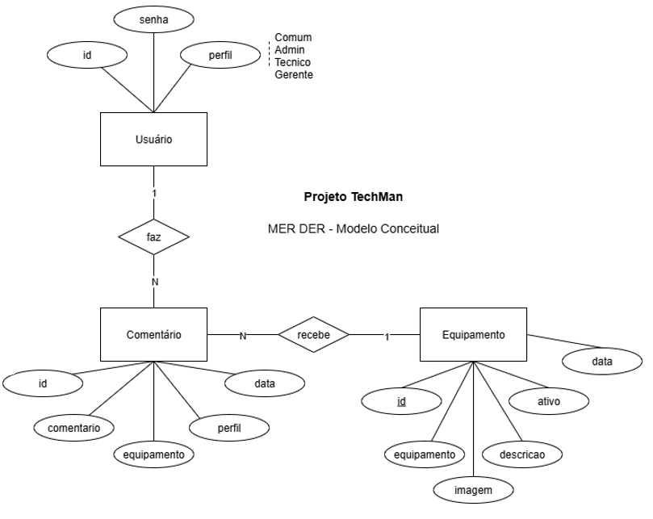

## 📄 `docs/README.md` (Documentação)

# 📚 Documentação - Techman 2025

Este diretório contém os arquivos de apoio e documentação técnica do projeto.

## 🧩 Diagrama Entidade-Relacionamento (DER)

O diagrama abaixo representa a modelagem do banco de dados relacional utilizado no projeto.

- **Usuários** possuem um perfil e podem adicionar comentários
- **Equipamentos** possuem status, descrição e imagem
- **Comentários** são vinculados a equipamentos e usuários

---

## 🔄 Diagrama de Atividades

O diagrama abaixo apresenta o fluxo de login do administrador e cadastro de novo equipamento.

---

## 📥 Dados importados

Os dados importados via script seed estão nos arquivos:

- `equipamentos.csv`
- `usuarios.csv`
- `comentarios.csv`
- `perfis.csv`

Os dados foram inseridos no banco via script `prisma/seed.js`.
